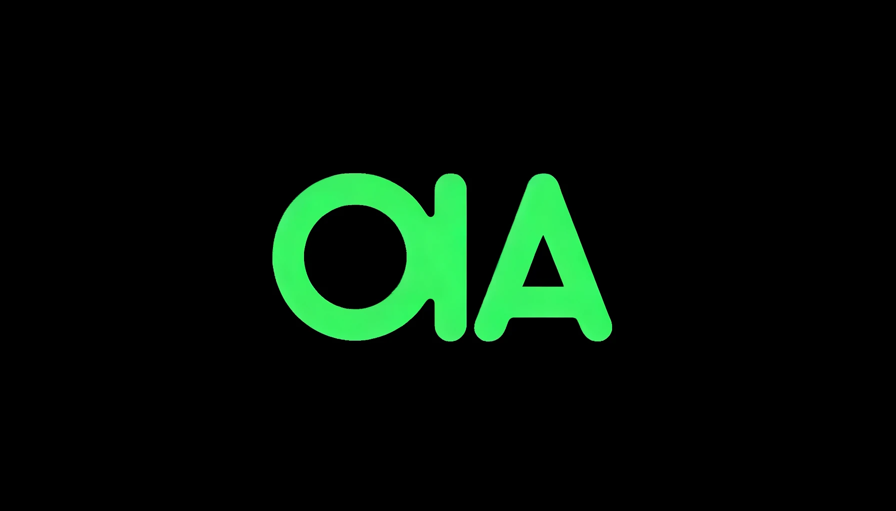

 [](https://github.com/Sin7Y/ola-lang/actions)
 [](LICENSE)
 [](https://github.com/Sin7y/ola-lang)
 [](https://twitter.com/ola_zkzkvm)

 ## Introduction

Ola is a high-level programming language for developing OlaVM smart contracts. It is Turing complete and can be used to write arithmetic programs. The computing process is proven by the OlaVM back-end proof system, which verifies that the OlaVM processing is accurate. Most of the existing programming languages in the ZKP field require fundamental knowledge of the circuit field, which is not universal, or the execution process is difficult to be proven and verified by ZKP.

 ## 📖 [Ola Language Documentation](https://olang.gitbook.io/ola-lang/)

## Simple Example

The following shows a simple contract for calculating the Fibonacci function

### Writing fibo case using Ola syntax

```
contract Fibonacci {

    fn fib_recursive(u32 n) -> (u32) {
        if (n <= 2) {
            return 1;
        }
        return fib_recursive(n -1) + fib_recursive(n -2);
    }

    fn fib_non_recursive(u32 n) -> (u32) {
        u32 first = 0;
        u32 second = 1;
        u32 third = 1;
        for (u32 i = 2; i <= n; i++) {
             third = first + second;
             first = second;
             second = third;
        }
        return third;
    }

}
```


## Roadmap

| Milestone                                                    | Status      | Difficulty                      |
| ------------------------------------------------------------ | ----------- | ------------------------------- |
| Support for simple calculations and function calls           | Completed   | Easy:grinning:                  |
| Better statement support and type system                     | Doing       | Medium:grin:                    |
| Smart Contract Storage Model Design                          | Doing       | Medium:grin:                    |
| Assembler, outputting better assembly format                 | Doing       | Easy:grinning:                  |
| Poseidon hash builtin function to reduce the complexity of proof systems | Not started | Medium :grin:                          |
| Prophet is designed to reduce the complexity of proof systems | Not started | Hard:upside_down_face: :muscle: |
| A more complete compilation back-end system, based on Ola opcode | Not started | Hard:upside_down_face::muscle:  |

In addition to the milestone design above， there are more details that need to be refined.

See the [open issues](https://github.com/Sin7Y/ola-lang/issues) for a list of proposed features (and known issues).

🧰 Troubleshooting
If you are having trouble installing and using Ola,  please open an [issue](https://github.com/Sin7Y/ola-lang/issues/new).

## License

[Apache 2.0](LICENSE)
