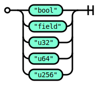
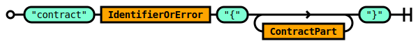
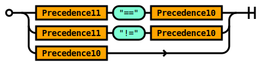
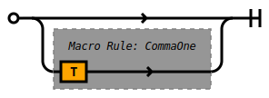

# Ola Grammar

## Rule SourceUnit


```ebnf
rule SourceUnit ::=
    SourceUnitPart *  
  ;

```


## Rule SourceUnitPart


```ebnf
rule SourceUnitPart ::=
    ContractDefinition 
  | ImportDirective 
  ;

```


## Rule ImportDirective


```ebnf
rule ImportDirective ::=
     'import' StringLiteral  ';' 
  |  'import' StringLiteral  'as' Identifier  ';' 
  ;

```


## Rule Type



```ebnf
rule Type ::=
     'bool' 
  |  'field' 
  |  'u32' 
  |  'u64' 
  |  'u256' 
  ;

```


## Rule IdentifierOrError


```ebnf
rule IdentifierOrError ::=
    Identifier 
  | 
  ;

```


## Rule VariableDeclaration


```ebnf
rule VariableDeclaration ::=
    Precedence0 IdentifierOrError 
  ;

```


## Rule StructDefinition


```ebnf
rule StructDefinition ::=
     'struct' IdentifierOrError  '{' ( VariableDeclaration  ';' ) *   '}' 
  ;

```


## Rule ContractPart


```ebnf
rule ContractPart ::=
    StructDefinition 
  | EnumDefinition 
  | VariableDefinition 
  | FunctionDefinition 
  | TypeDefinition 
  |  ';' 
  ;

```


## Rule ContractDefinition



```ebnf
rule ContractDefinition ::=
     'contract' IdentifierOrError  '{' ( ContractPart ) *   '}' 
  ;

```


## Rule EnumDefinition


```ebnf
rule EnumDefinition ::=
     'enum' IdentifierOrError  '{' Comma!(IdentifierOrError)  '}' 
  ;

```


## Rule VariableDefinition


```ebnf
rule VariableDefinition ::=
    Precedence0 VariableAttribute *  IdentifierOrError (  '=' Expression ) ?   ';' 
  | Precedence0 VariableAttribute *  Identifier  ';' 
  ;

```


## Rule TypeDefinition


```ebnf
rule TypeDefinition ::=
     'type' Identifier  '=' Precedence0  ';' 
  ;

```


## Rule VariableAttribute


```ebnf
rule VariableAttribute ::=
     'const' 
  |  'mut' 
  ;

```


## Rule Expression


```ebnf
rule Expression ::=
    Precedence14 
  ;

```


## Rule Precedence14


```ebnf
rule Precedence14 ::=
    Precedence13  '=' Precedence14 
  | Precedence13  '|=' Precedence14 
  | Precedence13  '^=' Precedence14 
  | Precedence13  '&=' Precedence14 
  | Precedence13  '<<=' Precedence14 
  | Precedence13  '>>=' Precedence14 
  | Precedence13  '+=' Precedence14 
  | Precedence13  '-=' Precedence14 
  | Precedence13  '*=' Precedence14 
  | Precedence13  '/=' Precedence14 
  | Precedence13  '%=' Precedence14 
  | Precedence13  '?' Precedence14  ':' Precedence14 
  | Precedence13 
  ;

```


## Rule Precedence13


```ebnf
rule Precedence13 ::=
    Precedence13  '||' Precedence12 
  | Precedence12 
  ;

```


## Rule Precedence12


```ebnf
rule Precedence12 ::=
    Precedence12  '&&' Precedence11 
  | Precedence11 
  ;

```


## Rule Precedence11



```ebnf
rule Precedence11 ::=
    Precedence11  '==' Precedence10 
  | Precedence11  '!=' Precedence10 
  | Precedence10 
  ;

```


## Rule Precedence10


```ebnf
rule Precedence10 ::=
    Precedence10  '<' Precedence9 
  | Precedence10  '>' Precedence9 
  | Precedence10  '<=' Precedence9 
  | Precedence10  '>=' Precedence9 
  | Precedence9 
  ;

```


## Rule Precedence9


```ebnf
rule Precedence9 ::=
    Precedence9  '|' Precedence8 
  | Precedence8 
  ;

```


## Rule Precedence8


```ebnf
rule Precedence8 ::=
    Precedence8  '^' Precedence7 
  | Precedence7 
  ;

```


## Rule Precedence7


```ebnf
rule Precedence7 ::=
    Precedence7  '&' Precedence6 
  | Precedence6 
  ;

```


## Rule Precedence6


```ebnf
rule Precedence6 ::=
    Precedence6  '<<' Precedence5 
  | Precedence6  '>>' Precedence5 
  | Precedence5 
  ;

```


## Rule Precedence5


```ebnf
rule Precedence5 ::=
    Precedence5  '+' Precedence4 
  | Precedence5  '-' Precedence4 
  | Precedence4 
  ;

```


## Rule Precedence4


```ebnf
rule Precedence4 ::=
    Precedence4  '*' Precedence3 
  | Precedence4  '/' Precedence3 
  | Precedence4  '%' Precedence3 
  | Precedence3 
  ;

```


## Rule Precedence3


```ebnf
rule Precedence3 ::=
    Precedence2  '**' Precedence3 
  | Precedence2 
  ;

```


## Rule Precedence2


```ebnf
rule Precedence2 ::=
     '!' Precedence2 
  |  '~' Precedence2 
  | Precedence0 
  ;

```


## Rule NamedArgument


```ebnf
rule NamedArgument ::=
    Identifier  ':' Expression 
  ;

```


## Rule FunctionCall


```ebnf
rule FunctionCall ::=
    Precedence0  '(' Comma!(Expression)  ')' 
  | Precedence0  '('  '{' Comma!(NamedArgument)  '}'  ')' 
  ;

```


## Rule Precedence0


```ebnf
rule Precedence0 ::=
    Precedence0  '++' 
  | Precedence0  '--' 
  | FunctionCall 
  | Precedence0  '[' Expression ?   ']' 
  | Precedence0  '[' Expression ?   ':' Expression ?   ']' 
  | Precedence0  '.' Identifier 
  | Type 
  |  '[' CommaOne!(Expression)  ']' 
  | Identifier 
  | ParameterList 
  | LiteralExpression 
  ;

```


## Rule LiteralExpression


```ebnf
rule LiteralExpression ::=
     'true' 
  |  'false' 
  | Number 
  ;

```


## Rule Parameter


```ebnf
rule Parameter ::=
    Expression Identifier ?  
  ;

```


## Rule OptParameter


```ebnf
rule OptParameter ::=
    Parameter ?  
  ;

```


## Rule ParameterList


```ebnf
rule ParameterList ::=
     '('  ')' 
  |  '(' Parameter  ')' 
  |  '(' CommaTwo!(OptParameter)  ')' 
  |  '('  ')' 
  ;

```


## Rule BlockStatementOrSemiColon


```ebnf
rule BlockStatementOrSemiColon ::=
     ';' 
  | BlockStatement 
  ;

```


## Rule FunctionDefinition


```ebnf
rule FunctionDefinition ::=
     'fn' IdentifierOrError ParameterList (  '->' ParameterList ) ?  BlockStatementOrSemiColon 
  ;

```


## Rule BlockStatement


```ebnf
rule BlockStatement ::=
     '{' Statement *   '}' 
  ;

```


## Rule OpenStatement


```ebnf
rule OpenStatement ::=
     'if'  '(' Expression  ')' Statement 
  |  'if'  '(' Expression  ')' ClosedStatement  'else' OpenStatement 
  |  'for'  '(' SimpleStatement ?   ';' Expression ?   ';' SimpleStatement ?   ')' OpenStatement 
  ;

```


## Rule ClosedStatement


```ebnf
rule ClosedStatement ::=
    NonIfStatement 
  |  'if'  '(' Expression  ')' ClosedStatement  'else' ClosedStatement 
  |  'for'  '(' SimpleStatement ?   ';' Expression ?   ';' SimpleStatement ?   ')' ClosedStatement 
  |  'for'  '(' SimpleStatement ?   ';' Expression ?   ';' SimpleStatement ?   ')'  ';' 
  ;

```


## Rule Statement


```ebnf
rule Statement ::=
    OpenStatement 
  | ClosedStatement 
  | 
  ;

```


## Rule SimpleStatement


```ebnf
rule SimpleStatement ::=
    VariableDeclaration (  '=' Expression ) ?  
  | Expression 
  ;

```


## Rule NonIfStatement


```ebnf
rule NonIfStatement ::=
    BlockStatement 
  | SimpleStatement  ';' 
  |  'continue'  ';' 
  |  'break'  ';' 
  |  'return'  ';' 
  |  'return' Expression  ';' 
  ;

```


## Rule Comma



```ebnf
macro Comma<T> ::=
    
  | CommaOne!(T) 
  ;

```


## Rule CommaOne


```ebnf
macro CommaOne<T> ::=
    T (  ',' T ) *  
  ;

```


## Rule CommaTwo


```ebnf
macro CommaTwo<T> ::=
    T (  ',' T ) +  
  ;

```


## Rule Number


```ebnf
rule Number ::=
     'r#([1-9][0-9]*|0)(u|ll|l)?#' 
  |  'r#0x[0-9A-Fa-f]*(u|ll|l)?#' 
  ;

```


## Rule Identifier


```ebnf
rule Identifier ::=
     'r#[$_]*[a-zA-Z][a-zA-Z$_0-9]*#' 
  ;

```


## Rule StringLiteral


```ebnf
rule StringLiteral ::=
     'r#\\[^\\]*\\#' 
  ;

```


