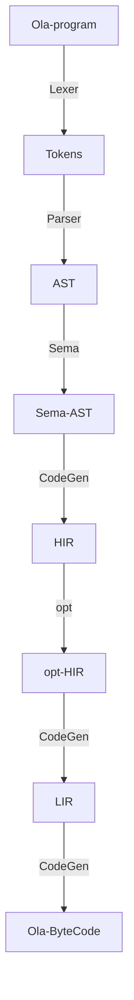
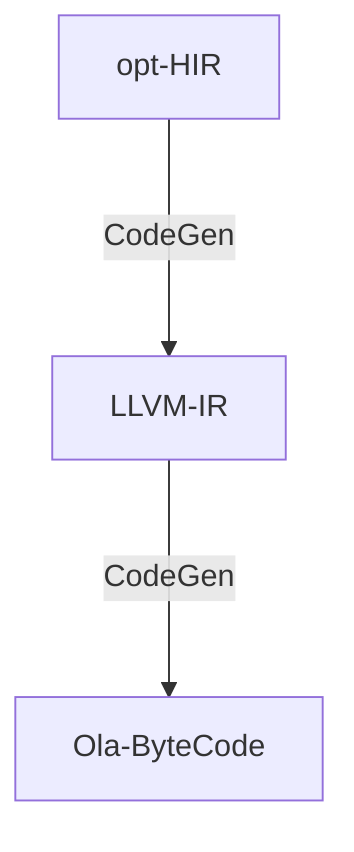
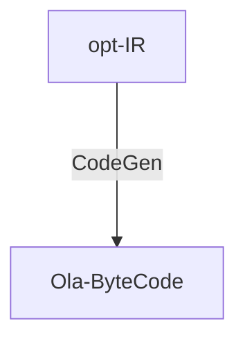

# IR Design

整体原则：保持 Olang 高层语言的操作与类型抽象，同时方便lower映射到 OlaVM 指令集。

## 编译流程



## HIR概述

主要考虑函数调用控制流与访存数据流。

### HIR指令类型

```
pub enum Instr {
    /// variable
    Variable {
        res: usize,
        expr: Expression,
    },
    /// Call function
    Call {
        res: Vec<usize>,
        return_tys: Vec<Type>,
        call: InternalCallTy,
        args: Vec<Expression>,
    },
    /// Return
    Return { value: Vec<Expression> },
    /// Jump unconditionally
    Branch { block: usize },
    /// Jump conditionally
    BranchCond {
        cond: Expression,
        true_block: usize,
        false_block: usize,
    },
    /// Set array element in memory
    Store { dest: Expression, data: Expression },
    /// Abort execution
    AssertFailure { encoded_args: Option<Expression> },
    /// TODO: Print to log message
    Print { expr: Expression },
    /// Push element on memory array
    PushMemory {
        res: usize,
        ty: Type,
        array: usize,
        value: Box<Expression>,
    },
    /// Pop element from memory array. 
    PopMemory { res: usize, ty: Type, array: usize },
    /// Create contract and call constructor.
    Constructor {
        success: Option<usize>,
        res: usize,
        contract_no: usize,
        encoded_args: Expression,
        encoded_args_len: Expression,
        value: Option<Expression>,
        salt: Option<Expression>,
        space: Option<Expression>,
    },
    /// Do nothing
    Nop,
    /// Return
    ReturnData {
        data: Expression,
        data_len: Expression,
    },
}
```
### 表达式类型
表达式的数据类型、结果、通用操作与操作数如下：
```
pub enum Expression {
    Add(Kind, Type, bool, Box<Expression>, Box<Expression>),
    AllocDynamicBytes(Kind, Type, Box<Expression>, Option<Vec<u8>>),
    ArrayLiteral(Kind, Type, Vec<u32>, Vec<Expression>),
    BitwiseAnd(Kind, Type, Box<Expression>, Box<Expression>),
    BitwiseOr(Kind, Type, Box<Expression>, Box<Expression>),
    BitwiseXor(Kind, Type, Box<Expression>, Box<Expression>),
    BoolLiteral(Kind, bool),
    Builtin(Kind, Vec<Type>, Builtin, Vec<Expression>),
    BytesLiteral(Kind, Type, Vec<u8>),
    Complement(Kind, Type, Box<Expression>),
    ConstArrayLiteral(Kind, Type, Vec<u32>, Vec<Expression>),
    Divide(Kind, Type, Box<Expression>, Box<Expression>),
    Equal(Kind, Box<Expression>, Box<Expression>),
    FormatString(Kind, Vec<(FormatArg, Expression)>),
    FunctionArg(Kind, Type, usize),
    GetRef(Kind, Type, Box<Expression>),
    FunctionCfg(usize),
    // Keccak256(Kind, Type, Vec<Expression>),
    // List(Kind, Vec<Expression>),
    Less(Kind, Box<Expression>, Box<Expression>),
    LessEqual(Kind, Box<Expression>, Box<Expression>),
    Load(Kind, Type, Box<Expression>),
    Modulo(Kind, Type, Box<Expression>, Box<Expression>),
    More(Kind, Box<Expression>, Box<Expression>),
    MoreEqual(Kind, Box<Expression>, Box<Expression>),
    Multiply(Kind, Type, bool, Box<Expression>, Box<Expression>),
    Not(Kind, Box<Expression>),
    NotEqual(Kind, Box<Expression>, Box<Expression>),
    NumberLiteral(Kind, Type, BigInt),
    Power(Kind, Type, bool, Box<Expression>, Box<Expression>),
    RationalNumberLiteral(Kind, Type, BigRational),
    ReturnData(Kind),
    ShiftLeft(Kind, Type, Box<Expression>, Box<Expression>),
    ShiftRight(Kind, Type, Box<Expression>, Box<Expression>, bool),
    ArrayLength {
        loc: Kind,
        ty: Type,
        array: Box<Expression>,
        elem_ty: Type,
    },
    StructLiteral(Kind, Type, Vec<Expression>),
    StructMember(Kind, Type, Box<Expression>, usize),
    Subscript(Kind, Type, Type, Box<Expression>, Box<Expression>),
    Subtract(Kind, Type, bool, Box<Expression>, Box<Expression>),
    UnaryMinus(Kind, Type, Box<Expression>),
    Undefined(Type),
    Variable(Kind, Type, usize),
    AdvancePointer {
        pointer: Box<Expression>,
        bytes_offset: Box<Expression>,
    },
}
```

其中，需要区分普通codegen与builtin：
```
pub enum Kind {
    Builtin,
    Codegen,
}
```
通用数据类型：
```
pub enum Type {
    Bool,
    U32,
    U64,
    U256,
    Field,
    Array(Box<Type>, Vec<ArrayLength>),
    Enum(usize),
    Struct(StructType),
    Contract(usize),
    Ref(Box<Type>),
    Function {
        params: Vec<Type>,
        returns: Vec<Type>,
    },
    UserType(usize),
    Unreachable,
    Slice(Box<Type>),
}
```
函数调用类型分为普通与`builtin`两类：
```
pub enum CallTy {
    Static { cfg_no: usize },
    Builtin { ast_func_no: usize },
}
```
### BB块

```
pub struct BasicBlock {
    pub phis: Option<BTreeSet<usize>>,
    pub name: String,
    pub instr: Vec<Instr>,
    pub defs: reaching_definitions::VarDefs,
    pub loop_reaching_variables: HashSet<usize>,
}
```
其中：
- `phis` 为数据流phi节点
- `Instr` 为上述HIR指令
- `VarDefs` 为全局变量符号表
```
pub type VarDefs = IndexMap<usize, IndexMap<Def, bool>>;
```
- `loop_reaching_variables`为循环变量集合

### CFG
CFG主要包含函数、BB块及数组控制流信息。
```
pub struct ControlFlowGraph {
    pub name: String,
    pub function_no: ASTFunction,
    pub params: Arc<Vec<Parameter>>,
    pub returns: Arc<Vec<Parameter>>,
    pub vars: Vars,
    pub blocks: Vec<BasicBlock>,
    pub nonpayable: bool,
    pub public: bool,
    pub ty: pt::FunctionTy,
    pub selector: Vec<u8>,
    current: usize,
    pub array_lengths_temps: ArrayLengthVars,
}
```

## Opt

将基于HIR,引入如下优化遍:

- constant_folding
- vector_to_slice
- strength_reduce
- dead_storage

## CodeGen

考虑如下两种方案，分别为两级IR及一级IR 

### LIR为通用化的LLVM IR


### 一级IR直接生成Ola-ByteCode



~~op操作包含如下：~~

```
/// An operator
pub enum Op {
    /// a variable
    Var(String),
    /// a constant
    Const(Value),

    /// if-then-else: ternary
    Ite,
    /// equality
    Eq,

    /// bit-vector binary operator
    BvBinOp(BvBinOp),
    /// bit-vector n-ary operator
    BvNaryOp(BvNaryOp),
    /// bit-vector unary operator
    BvUnOp(BvUnOp),
    /// single-bit bit-vector from a boolean
    BoolToBv,
    /// Zero-indexed and inclusive.
    BvExtract(usize, usize),
    /// bit-vector concatenation. n-ary. Low-index arguements map to high-order bits
    BvConcat,
    /// add this many zero bits
    BvUext(usize),
    /// add this many sign-extend bits
    BvSext(usize),

    /// boolean implication (binary)
    Implies,
    /// boolean n-ary operator
    BoolNaryOp(BoolNaryOp),
    /// boolean not
    Not,
    /// get this index bit from an input bit-vector
    BvBit(usize),

    /// Integer n-ary operator
    IntNaryOp(IntNaryOp),
    /// Integer comparison operator
    IntBinPred(IntBinPred),

    /// Binary operator, with arguments (array, index).
    ///
    /// Gets the value at index in array.
    Select,
    /// Ternary operator, with arguments (array, index, value).
    ///
    /// Makes an array equal to `array`, but with `value` at `index`.
    Store,

    /// Assemble n things into a tuple
    Tuple,
    /// Get the n'th element of a tuple
    Field(usize),
    /// Update (tuple, element)
    Update(usize),

    /// Map (operation)
    Map(Box<Op>),

    /// Call a function (name, argument sorts, return sort)
    Call(String, Vec<Sort>, Sort),

    /// Cyclic right rotation of an array
    /// i.e. (Rot(1) [1,2,3,4]) --> ([4,1,2,3])
    Rot(usize),
}
```

其中，具体op类型包含
```
/// Boolean n-ary operator
pub enum BoolNaryOp {
    /// Boolean AND
    And,
    /// Boolean XOR
    Xor,
    /// Boolean OR
    Or,
}

/// Bit-vector binary operator
pub enum BvBinOp {
    /// Bit-vector (-)
    Sub,
    /// Bit-vector (/)
    Udiv,
    /// Bit-vector (%)
    Urem,
    /// Bit-vector (<<)
    Shl,
    /// Bit-vector arithmetic (sign extend) (>>)
    Ashr,
    /// Bit-vector logical (zero fill) (>>)
    Lshr,
}

/// Bit-vector binary predicate
pub enum BvBinPred {
    // TODO: add overflow predicates.
    /// Bit-vector unsigned (<)
    Ult,
    /// Bit-vector unsigned (>)
    Ugt,
    /// Bit-vector unsigned (<=)
    Ule,
    /// Bit-vector unsigned (>=)
    Uge,
    /// Bit-vector signed (<)
    Slt,
    /// Bit-vector signed (>)
    Sgt,
    /// Bit-vector signed (<=)
    Sle,
    /// Bit-vector signed (>=)
    Sge,
}

/// Bit-vector n-ary operator
pub enum BvNaryOp {
    /// Bit-vector (+)
    Add,
    /// Bit-vector (*)
    Mul,
    /// Bit-vector bitwise OR
    Or,
    /// Bit-vector bitwise AND
    And,
    /// Bit-vector bitwise XOR
    Xor,
}

/// Bit-vector unary operator
pub enum BvUnOp {
    /// Bit-vector bitwise not
    Not,
    /// Bit-vector two's complement negation
    Neg,
}

/// Integer binary predicate. See [Op::Eq] for equality.
pub enum IntBinPred {
    /// Integer (<)
    Lt,
    /// Integer (>)
    Gt,
    /// Integer (<=)
    Le,
    /// Integer (>=)
    Ge,
}

/// The "type" of an IR term
pub enum Sort {
    /// bit-vectors of this width
    BitVector(usize),
    /// arbitrary-precision integer
    Int,
    /// boolean
    Bool,
    /// Array from one sort to another, of fixed size.
    ///
    /// size presumes an order, and a zero, for the key sort.
    Array(Box<Sort>, Box<Sort>, usize),
    /// A tuple
    Tuple(Box<[Sort]>),
}

/// An IR array value.
///
/// A sized, space array.
pub struct Array {
    /// Key sort
    pub key_sort: Sort,
    /// Default (fill) value. What is stored when a key is missing from the next member
    pub default: Box<Value>,
    /// Key-> Value map
    pub map: BTreeMap<Value, Value>,
    /// Size of array. There are this many valid keys.
    pub size: usize,
}
```